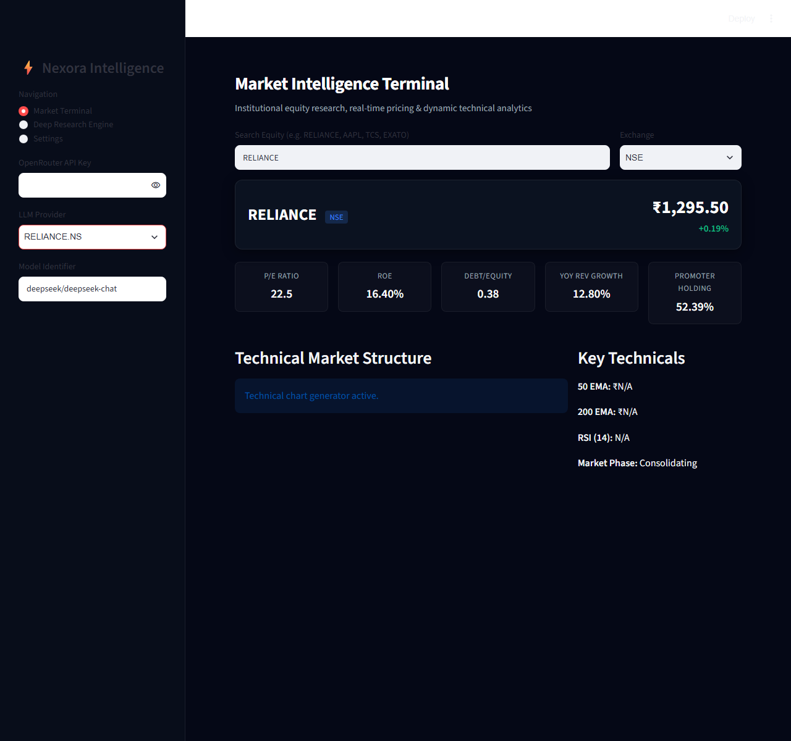

# Nexora - The Next Era of Investing

Nexora is an institutional-grade investment research platform powered by multi-source data compilation and cynical AI analytics. It bypasses market noise to expose direct financial truths, providing tools for real-time market tracking, deep fundamental research, and AI-driven thesis generation.

## Features

- Real-Time Data Engine: Track live market pricing (CMP), percentage shifts, and key technical ratios across Indian (NSE, BSE) and US exchanges dynamically using yfinance.
- Market Intelligence Terminal: A Streamlit-based interactive dashboard that visualizes technicals (MACD, RSI, Bollinger Bands) alongside key fundamentals (P/E, ROE, YoY Growth).
- Cynical AI Thesis Builder: Processes raw compiled documents using state-of-the-art LLMs (like Claude-3.5-Sonnet or DeepSeek via OpenRouter) to generate uncompromised, institutional-grade risk reports.
- Secure Authentication: Built-in Clerk authentication for secure, personalized access.

## Stock Analysis (RELIANCE.NS)

Below is a complete analysis of an Indian market stock (RELIANCE) generated by the platform.

### 1. Market Terminal Overview
This section provides real-time pricing and fundamental metrics.


### 2. Technical Market Structure
This section contains dynamic technical analytics including moving averages, MACD, and RSI.


### 3. Cynical AI Research Thesis
This section presents the uncompromised AI analysis evaluating risks, growth, and market structure.


## Architecture

- Frontend: Custom HTML/CSS/JS with a fluid, dark-mode focused UI. Authentication powered by ClerkJS.
- Backend: Python ThreadingHTTPServer (dashboard.py) handling secure API routes and LLM interactions.
- Data & AI Terminal: Streamlit (app.py) for heavy data lifting, interactive charts, and dynamic technical analysis.
- LLM Integration: Flask/Custom endpoints communicating with OpenRouter, Anthropic, or Gemini for the "Cynical AI" insights.

## Local Development Setup

1. Install dependencies:
   ```bash
   pip install -r requirements.txt
   ```

2. Set up Environment Variables:
   Copy `.env.example` to `.env` and configure your API keys:
   ```env
   CLERK_PUBLISHABLE_KEY=your_clerk_key
   OPENROUTER_API_KEY=your_openrouter_key
   ```

3. Run the Backend Dashboard:
   ```bash
   python dashboard.py
   ```

4. Run the Data Terminal:
   ```bash
   streamlit run app.py
   ```

## Deployment

Nexora is configured for production deployments:
- Vercel: `vercel.json` provides serverless function routing for the APIs (`/api/index.py`) and static hosting for the frontend.
