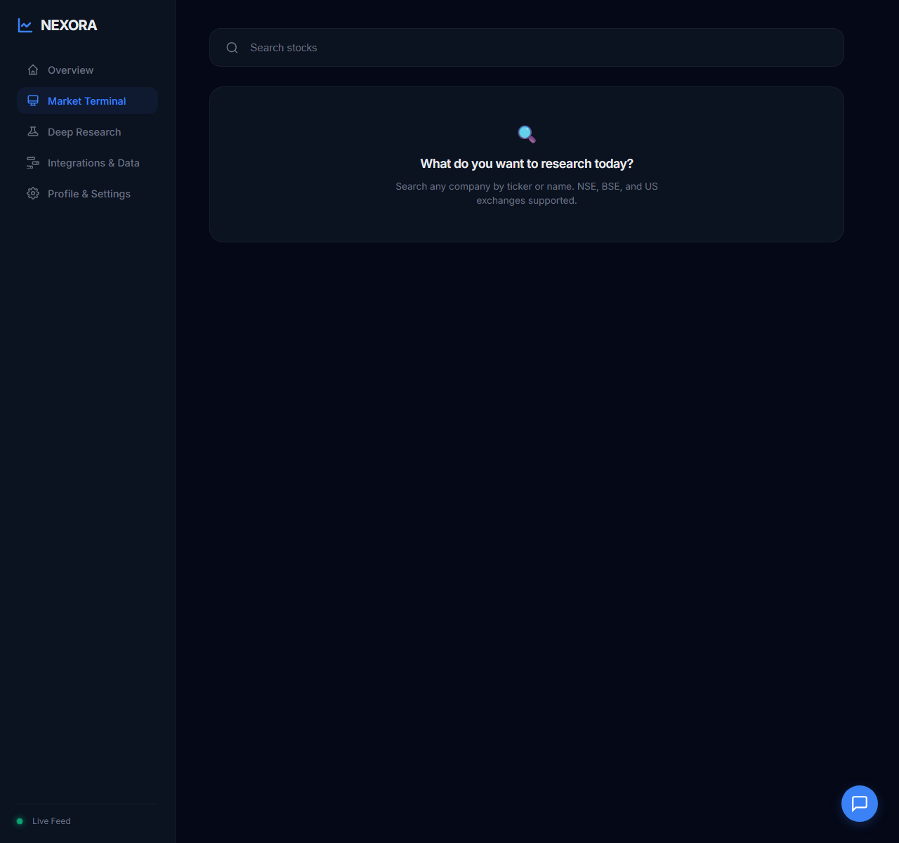
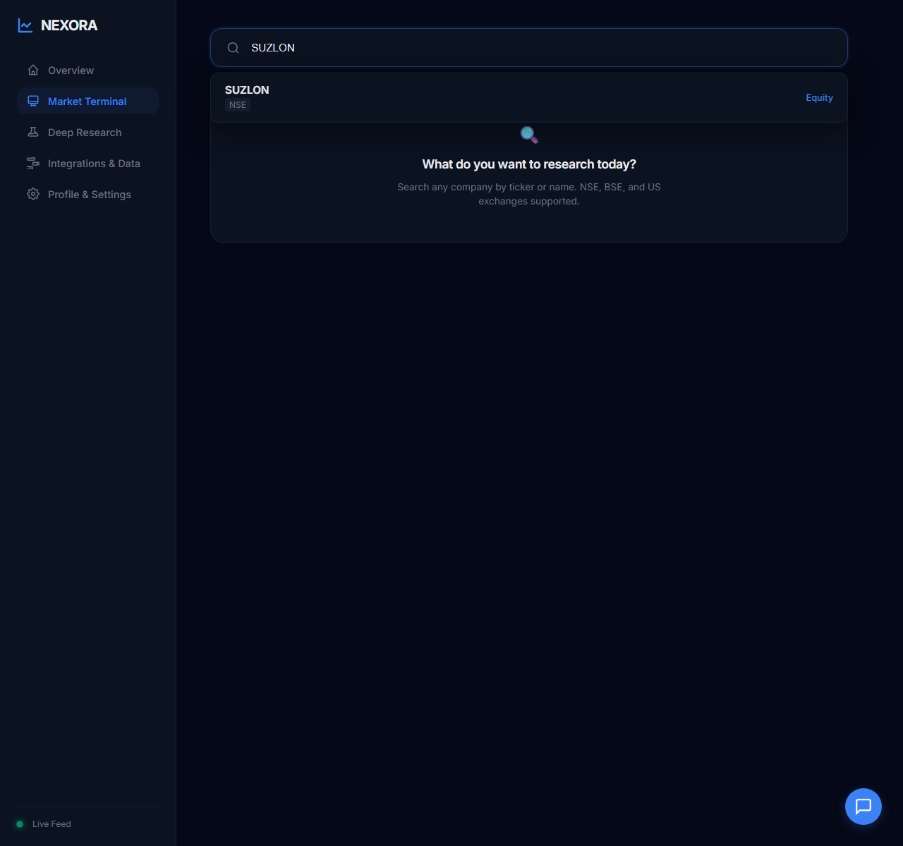
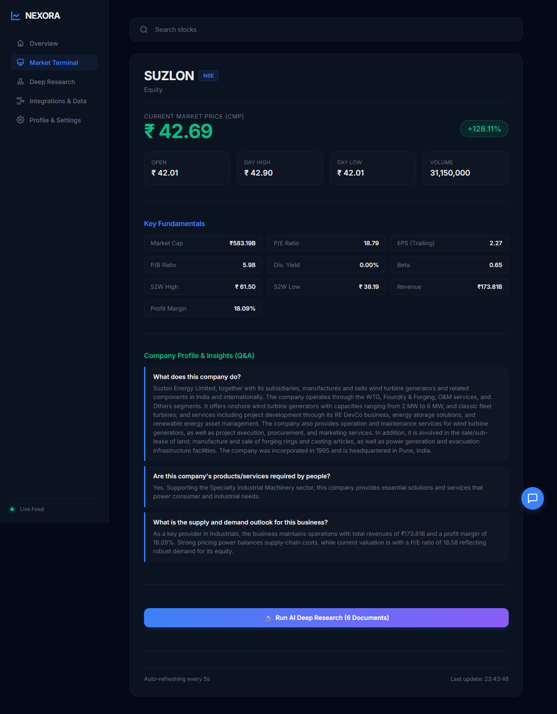
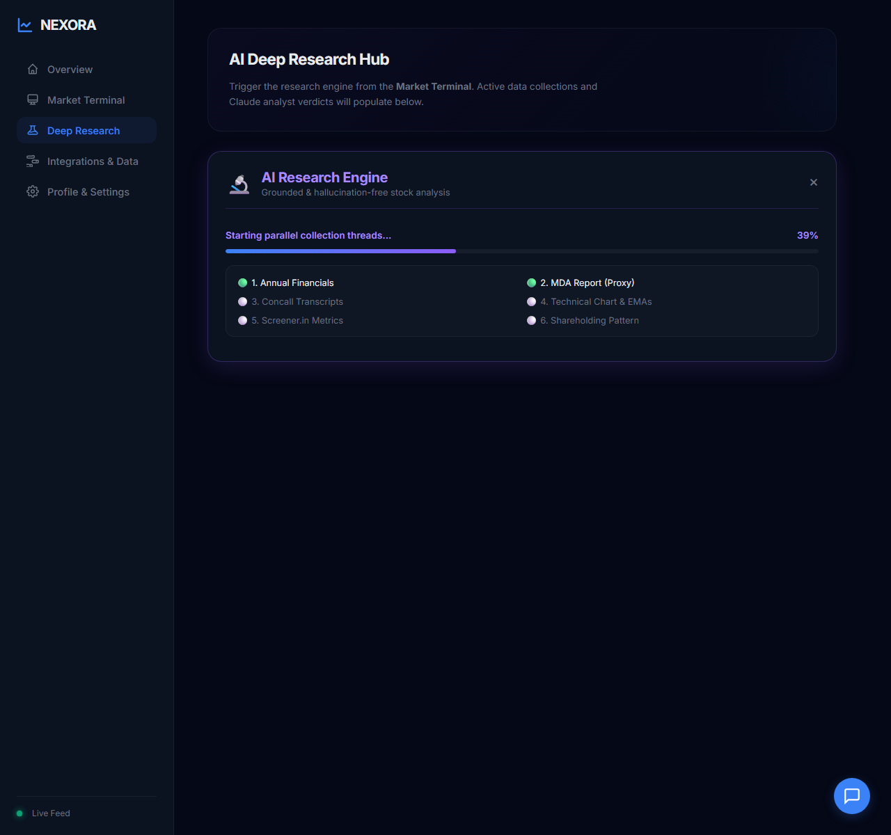
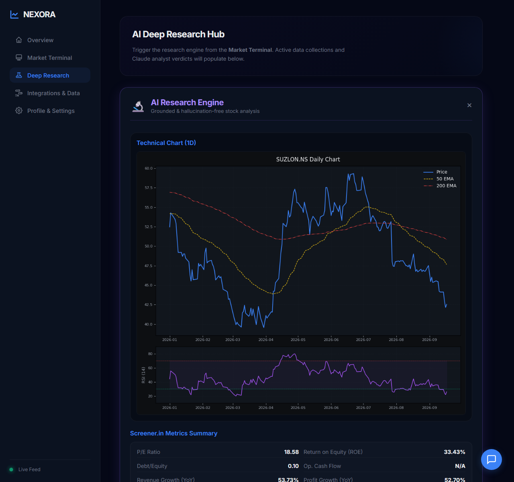
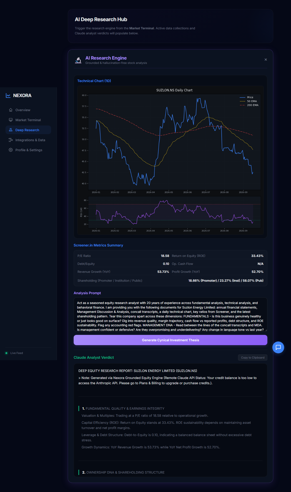

# Nexora - The Next Era of Investing

Nexora is an institutional-grade investment research platform powered by multi-source data compilation and cynical AI analytics. It bypasses market noise to expose direct financial truths, providing tools for real-time market tracking, deep fundamental research, and AI-driven thesis generation.

## End-to-End Vercel Deployment Test (Niche Stock: SUZLON)

Below is an automated step-by-step test of our Vercel-deployed application running a deep research analysis on a niche Indian stock (`SUZLON`).

### Step 1: Dashboard Home
The central hub for your investment research and AI queries.


### Step 2: Searching the Market
Searching for a niche stock symbol. The platform queries real-time pricing and basic info.


### Step 3: Stock Overview
Retrieving live fundamental data and the current market price (CMP).


### Step 4: Automated Data Collection
Triggering Deep Research. The engine starts scraping 6 key documents (financials, management transcripts, proxy reports, technical charts, ratios, and shareholding metrics) in parallel.


### Step 5: Data Compilation Complete
All documents have been successfully scraped and compiled, ready to be sent to the AI for analysis.


### Step 6: Cynical AI Research Thesis
The final uncompromised AI analysis evaluating risks, growth, and market structure.


## Architecture

- Frontend: Custom HTML/CSS/JS with a fluid, dark-mode focused UI. Authentication powered by ClerkJS.
- Backend: Vercel Serverless Functions (`/api/index.py`) handling secure API routes and AI integrations.
- Heavy Lifting: Streamlit terminal available for deeper offline technical analysis.
- AI Integration: Communicates with OpenRouter, Anthropic, or Gemini for the "Cynical AI" insights.

## Local Development Setup

1. Install dependencies:
   ```bash
   pip install -r requirements.txt
   ```
2. Configure `.env` keys (Clerk, OpenRouter, etc.).
3. Run Local Backend: `python dashboard.py`
4. Run Local Terminal: `streamlit run app.py`
